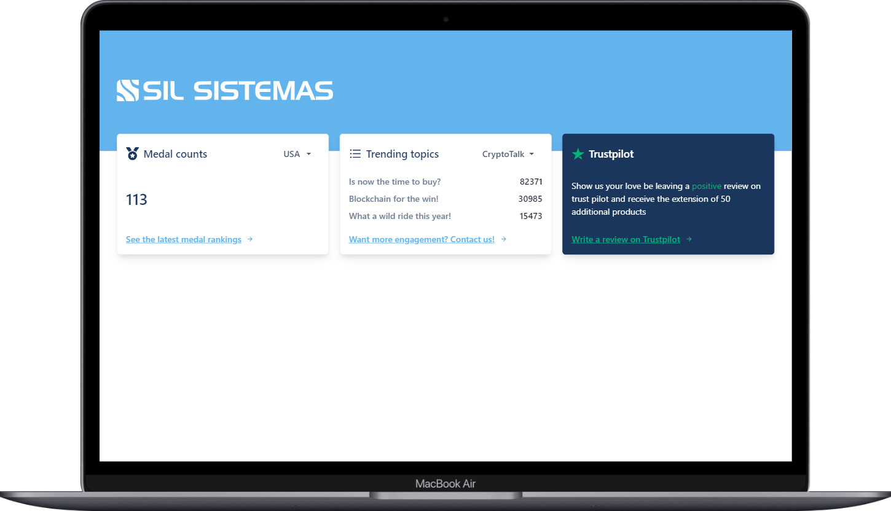
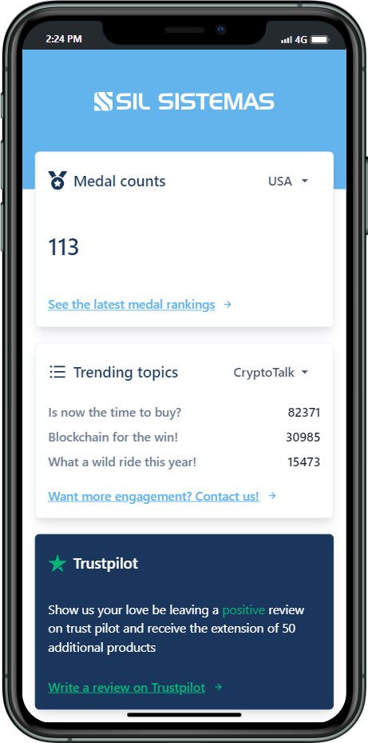

# Desafio Desenvolvedor Front End - React

<a href="https://sil-react-test.vercel.app/">🖥️ DEPLOY DO PROJETO</a>

## Como rodar o projeto?

1. Faça o clone do repositório, abra um novo terminal na raíz do projeto.
2. Instale as dependências usando seu gerenciador de pacotes (npm, pnpm ou yarn).
```bash
pnpm install
```
3. Após isso, só iniciar a aplicação. O json-server está hospedado na Vercel.
```bash
pnpm dev
```
OBS: Caso seja necessário, para rodar o banco local, basta trocar a baseURL para "localURL" em src/utils/axios e executar o seguinte comando no terminal.
```bash
pnpm db
```


## 📱 Preview do Projeto


<p align="center">
  
</p>

<p align="center">
  
</p>

## 🧑‍💻 Sobre o projeto

Este projeto é parte de um desafio que avalia a habilidade de implementar funcionalidades e exibir informações dinâmicas e estáticas em componentes reutilizáveis utilizando ReactJs com TypeScript.

## 🚀 Tecnologias utilizadas

- [ReactJS](https://reactjs.org/)
- [TypeScript](https://www.typescriptlang.org/)
- [Axios](https://github.com/axios/axios)
- [Chakra UI](https://chakra-ui.com/)
- [Json Server](https://github.com/typicode/json-server)
- [Vitest](https://vitest.dev/)


<h3>
  <a href="https://www.linkedin.com/in/felipegrondek">🔗 Vamos nos conectar no linkedin?</a>
</h3>
